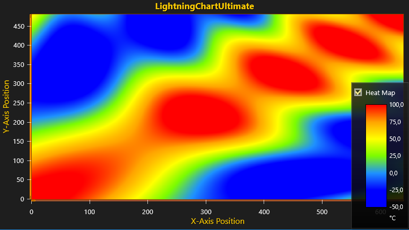
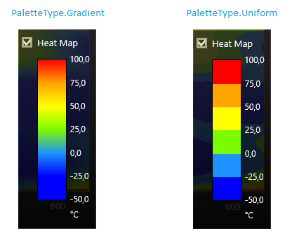

# Simple 2D Heat Map Chart

With *LightningChart* you can create different types of charts for various use-cases. Previous tutorials have demonstrated how to create simple 2D charts with multiple line-series and axes, area-series and bar-series. In this tutorial, we will show how to create a Simple 2D Heat Map using *IntensityGridSeries*.



A Heat Map is a matrix containing individual values which are presented as colors. In data visualization, Heat Maps can be utilized to provide visual content and feedback about data values through variations in coloring. For this tutorial, we recommend you create a new WinForms or WPF application. *LightningChart* offers two methods for creating Heat Maps - *IntensityGridSeries* and *IntensityMeshSeries*. *IntensityGrid* is evenly-spaced, rectangular series in X and Y space which allows visualization of M x N array of nodes. *IntensityMesh* is similar to the *IntensityGrid*, but in *IntensityMesh*, series does not need to be rectangular, while series nodes can be positioned arbitrarily in the X and Y space. For this tutorial, we are using the *IntensityGridSeries*.

##### 1. Create a Heat Map instance as IntensityGridSeries.

```csharp
// Create a Heat Map as IntensityGridSeries.
var heatMap = new IntensityGridSeries(_chart.ViewXY, axisX, axisY);
```
In order to present data values in the required colors, we need to create a *ValueRangePalette*. *ValueRangePalette* is used to define the colors for data coloring based on the values.

##### 2. Create a ValueRangePalette for IntensityGridSeries.

```csharp
// Creating palette for IntensityGridSeries.
var palette = new ValueRangePalette(series);
```
*LightningChart* has preset values for *ValueRangePalette*. In order to color the data in the desired way, we firstly need to clear the *ValueRangePalette* and its palette steps.


##### 3. Clear preset values from ValueRangePalette.

```csharp
// LightningChart has some preset values for palette steps.
// Clear the preset values from palette before setting new ones.
foreach (var step in palette.Steps)
{
    step.Dispose();
}
palette.Steps.Clear();
```

Then we need to set colors for our palette together with *PaletteType*. You can define colors using *System.Windows.Media.Color* or *System.Drawing.Color* depending on whether you are using WPF or WinForms. *PaletteType* defines how the palette coloring will look in your application.



For this example, we are setting *PaletteType* to *Gradient*.

##### 4. Define palette steps used for coloring the data.

```csharp
// Add steps into palette. 
// Palette is used for presenting data in Heat Map with different colors based on their value.
palette.Steps.Add(new PaletteStep(palette, Color.FromRgb(0, 0, 255), -25));
palette.Steps.Add(new PaletteStep(palette, Color.FromRgb(20, 150, 255), 0));
palette.Steps.Add(new PaletteStep(palette, Color.FromRgb(0, 255, 0), 25));
palette.Steps.Add(new PaletteStep(palette, Color.FromRgb(255, 255, 20), 50));
palette.Steps.Add(new PaletteStep(palette, Color.FromRgb(255, 150, 20), 75));
palette.Steps.Add(new PaletteStep(palette, Color.FromRgb(255, 0, 0), 100));
palette.Type = PaletteType.Gradient;
palette.MinValue = -50;
```

You can add data to Heat Map by using *IntensityPoints*. *IntensityPoints* are datapoints for Intensity series. In this example, we fill our IntensityGrid with values as *IntensityPoints* which are colored with the *ValueRangePalette*.

##### 5. Generate data for Heat Map.

```csharp
// Generate data.
public void GenerateData(int columns, int rows)
{
    // Create new IntensityPoint series for data.
    var data = new IntensityPoint[_columns, _rows];

    // Disable rendering before updating chart properties to improve performance
    // and to prevent unnecessary chart redrawing while changing multiple properties.
    _chart.BeginUpdate();

    // Set data values and add them to Heat Map.
    for (int i = 0; i < _columns; i++)
    {
        for (int j = 0; j < _rows; j++)
        {
            // Add values to the IntensityPoint series, points are generated by using following function.
            data[i, j].Value = 30.0 + 20 * Math.Cos(20 + 0.0001 * (double)(i * j)) + 70.0 * Math.Cos((double)(j - i) * 0.01);
        }
    }

    // Add generated data as Heat Map data.
    _heatMap.Data = data;

    // Call EndUpdate to enable rendering again.
    _chart.EndUpdate();
}
```
